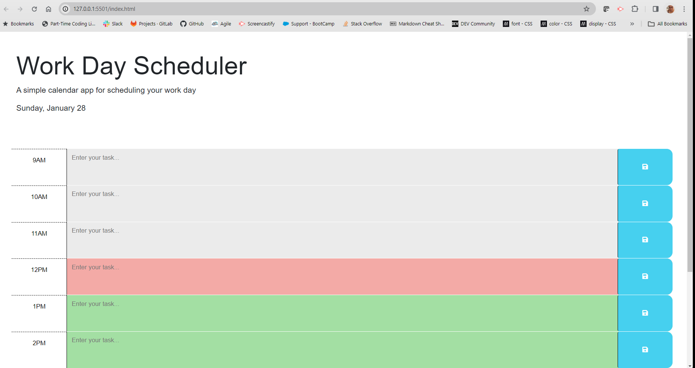
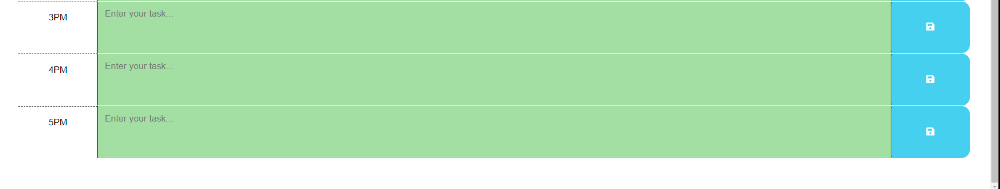

# 05 Third Party API's

## My Task

My taks is to create a simple calendar application that allows a user to save events for each hour of a typical working day (9am–5pm) by modifying starter code provided. This app will run in the browser and feature dynamically updated HTML and CSS powered by jQuery.

## User Story
```
AS A coding boot camp student
I WANT to take a timed quiz on JavaScript fundamentals that stores high scores
SO THAT I can gauge my progress compared to my peers
```

## Acceptance Chriteria
```
GIVEN I am using a daily planner to create a schedule
WHEN I open the planner
THEN the current day is displayed at the top of the calendar
WHEN I scroll down
THEN I am presented with timeblocks for standard business hours of 9am&ndash;5pm
WHEN I view the timeblocks for that day
THEN each timeblock is color coded to indicate whether it is in the past, present, or future
WHEN I click into a timeblock
THEN I can enter an event
WHEN I click the save button for that timeblock
THEN the text for that event is saved in local storage
WHEN I refresh the page
THEN the saved events persist

```
## Screen Shots



## Review Links

GitHub Link: https://github.com/Marisol514/My-Day

Deployed Link: 

## Resources:

Bootstrap versions: https://getbootstrap.com/docs/5.1/getting-started/introduction/#quick-start

Font Awesome: https://fontawesome.com/docs/web/setup/get-started 

jQuery: https://api.jquery.com/

jQuery Selector: https://api.jquery.com/jquery/#jQuery-selector-context

jQuery Element Selector: https://learn.jquery.com/using-jquery-core/selecting-elements/

jQuery Selectors: https://api.jquery.com/category/selectors/

JQuert Array: https://api.jquery.com/Types/#Array

jQuery Adding a div: https://developer.mozilla.org/en-US/docs/Mozilla/Add-ons/WebExtensions/Safely_inserting_external_content_into_a_page
 
Google Font - Fira Sans: https://fonts.google.com/selection/embed

Document Object Model (DOM): https://developer.mozilla.org/en-US/docs/Web/API/Document_Object_Model

JavaScript HTML DOM: https://www.w3schools.com/js/js_htmldom.asp 

Event: https://developer.mozilla.org/en-US/docs/Web/Events

       https://developer.mozilla.org/en-US/docs/Web/API/Event 

Day.js hour: https://day.js.org/docs/en/display/format

Day.js format to AM PM: https://day.js.org/docs/en/installation/typescript#have-trouble-importing-dayjs 

Day.js String+Format: https://day.js.org/docs/en/parse/string-format

Day.js 'this'': chttps://www.geeksforgeeks.org/difference-between-this-and-this-in-jquery/ 

JavaScript 'fuction': https://developer.mozilla.org/en-US/docs/Web/JavaScript/Reference/Statements/function

JavaScript 'fuction Binding' Option: https://developer.mozilla.org/en-US/docs/Glossary/Binding

JavaScript 'var' as Binding Option: https://developer.mozilla.org/en-US/docs/Web/JavaScript/Reference/Statements/var

JavaScript 'array': https://developer.mozilla.org/en-US/docs/Glossary/Array

JavaScript 'for' Loop: https://developer.mozilla.org/en-US/docs/Web/JavaScript/Reference/Errors/Invalid_for-in_initializer

JavaScritpt 'for in': https://developer.mozilla.org/en-US/docs/Web/JavaScript/Reference/Statements/for...in

JavaScript 'date': https://developer.mozilla.org/en-US/docs/Web/JavaScript/Reference/Global_Objects/Date

JavaScript 'parseInt(): https://developer.mozilla.org/en-US/docs/Web/JavaScript/Reference/Global_Objects/parseInt

JavaScript Class manipulation: https://developer.mozilla.org/en-US/docs/Web/API/Element/classList

JavaScript Set Interval: https://developer.mozilla.org/en-US/docs/Web/API/setInterval

Time BLock Applications: https://todoist.com/productivity-methods/time-blocking

Time Blocking: https://www.youtube.com/watch?v=arbu_mw3qXM

Examples of updateTimeBlocks implementation: https://gist.github.com/index


